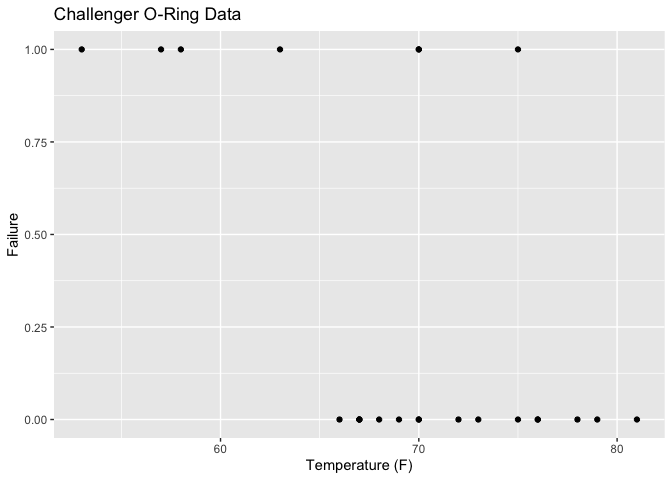

# Challenger Dataset

Rendered from
[challenger.qmd](https://github.com/tensorchiefs/data/tree/docs/data/challenger.qmd)

This file can be loaded with:

    df = load_data('challenger.csv')

## Description

This dataset contains information about the O-rings of the solid rocket
boosters used in the Space Shuttle program. The data was collected
during the investigation of the Space Shuttle Challenger disaster in
1986 (Rogers commission). Here we provide a binarized version of the
original dataset, where the dependent variable `y` indicates whether at
least O-ring failed (1) or not (0). This data is often used as an
example of logistic regression.

### Further Information

A nice background story about the Challenger disaster and the fatal data
analysis done can be found in:
https://homafiles.info/2016/06/06/the-challenger-disaster-a-tragic-lesson-in-data-analysis/



### Addtional Functionality

Additional functionality, note that this is not excecuted in the
document. Also note the name.

#### Standart Function

Code junks named `plot_data` are reserved names and by convention they
appear in many other datasets.

``` r
#plot_data
library(ggplot2)
ggplot(data, aes(x = Temp, y = Failure)) +
  geom_point() + 
  xlab("Temperature (F)") +
  ggtitle("Challenger O-Ring Data")
```

#### Custom Functions

TODO
